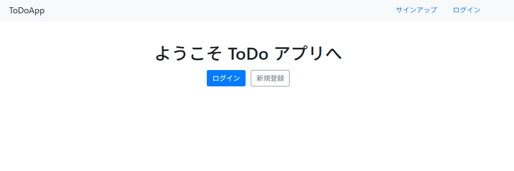
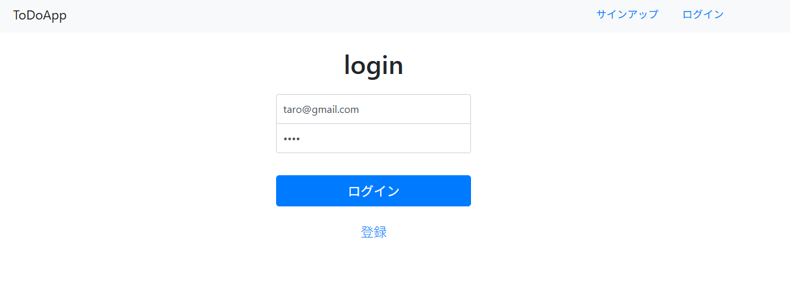
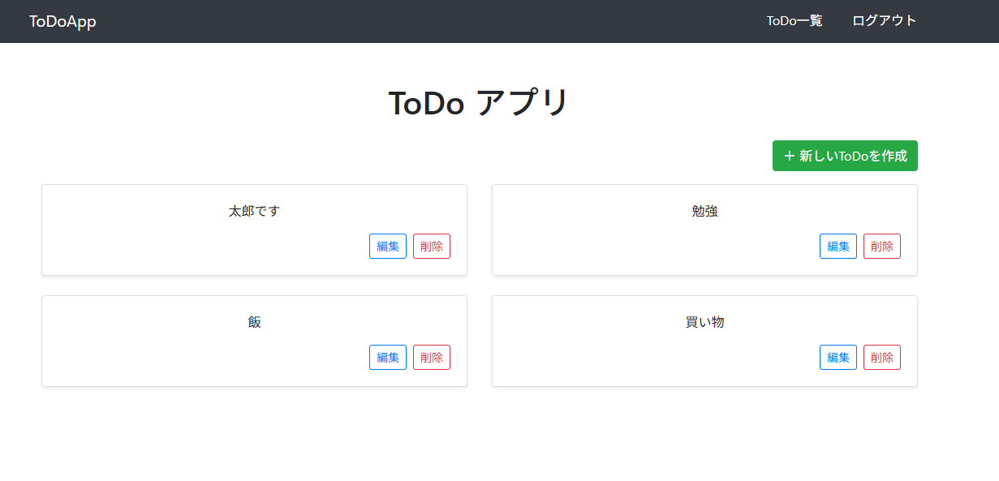

# Go-Todo-App

[English](./docs/lang/en.md) | 日本語

このアプリは、Go 言語と SQLite を使って作成されたシンプルな ToDo 管理アプリです。

ユーザー登録、ログイン、タスクの追加・編集・削除といった基本機能を備えています。

## スクリーンショット






## 主な機能

- ユーザー登録・ログイン・ログアウト
- タスクの追加・編集・削除
- セッション管理によるログイン状態の保持
- ログイン前後で表示が変わる画面（public/private）

---

## 導入手順（ローカルで実行）

### 前提

- **Go（1.20 以上）** がインストールされていること  
  インストールされていない場合：[Go 公式サイト](https://golang.org/dl/) からインストールしてください
- **GCC コンパイラ** がインストールされていること（SQLite の CGO サポートのため）
  ```bash
  sudo apt update
  sudo apt install -y build-essential
  ```
- デフォルトでは起動サーバーは 8080 なので、事前にポートを空けてください

---

### 1. リポジトリをクローン

```bash
git clone repogitory
cd Go-Todo-App
```

---

### 2. モジュールを初期化（依存パッケージの取得）

```bash
go mod tidy
```

---

### 3. `config/config.ini` の設定確認

現在は以下の設定がされています。ポートなどご自身の環境に合わせて変更してください。

```ini
[web]
port = 8080
logfile = debug.log
static = app/views

[db]
driver = sqlite3
name = webapp.sql
```

---

### 4. アプリを実行

```bash
go run main.go
```

**注意**: CGO が有効になっていることを確認してください。環境変数 `CGO_ENABLED=1` が設定されているか、以下のコマンドで確認できます：

```bash
go env CGO_ENABLED
```

- 実行時、 `webapp.sql`・`debug.log`が生成されます。

---

### 5. ブラウザでアクセス

`config/config.ini` のデフォルトに合わせています。
ポート番号を変更した場合は、適宜変更してください。

```ini
http://localhost:8080
```

---

## メモ・補足

- SQLite のデータは `webapp.sql` に保存されます
- セッションはクッキーと DB で管理しています
- テンプレートは `layout.html` を共通としてパーツを切り替える構成です
