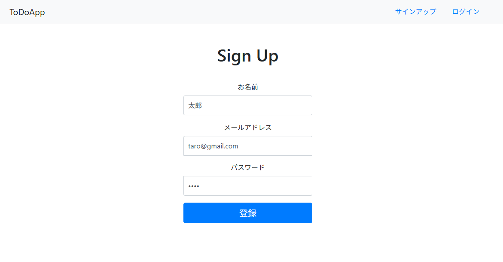

# Go-Todo-App

[日本語](../../README.md) | English

This is a simple ToDo management app created with Go and SQLite.

It includes basic features such as user registration, login, and task addition/editing/deletion.

## Screenshots





## Main Features

- User registration, login, logout
- Task addition, editing, deletion
- Session management for maintaining login state
- Different display before and after login (public/private)

---

## Setup Instructions (Local Execution)

### Prerequisites

- **Go (1.20 or higher)** must be installed  
  If not installed: Install from [Go Official Website](https://golang.org/dl/)
- **GCC Compiler** must be installed (for SQLite CGO support)
  ```bash
  sudo apt update
  sudo apt install -y build-essential
  ```
- Default server starts on port 8080, so please ensure the port is available

---

### 1. Clone the Repository

```bash
git clone repogitory
cd Go-Todo-App
```

---

### 2. Initialize Modules (Get Dependencies)

```bash
go mod tidy
```

---

### 3. Check `config/config.ini` Settings

The following settings are currently configured. Please change the port and other settings according to your environment.

```ini
[web]
port = 8080
logfile = debug.log
static = app/views

[db]
driver = sqlite3
name = webapp.sql
```

---

### 4. Run the Application

```bash
go run main.go
```

**Note**: Please ensure CGO is enabled. You can check if the environment variable `CGO_ENABLED=1` is set with the following command:

```bash
go env CGO_ENABLED
```

- When executed, `webapp.sql` and `debug.log` will be generated.

---

### 5. Access via Browser

Access according to the default settings in `config/config.ini`.
If you changed the port number, please modify accordingly.

```ini
http://localhost:8080
```

---

## Notes and Additional Information

- SQLite data is saved in `webapp.sql`
- Sessions are managed with cookies and DB
- Templates use `layout.html` as a common base and switch parts as needed
